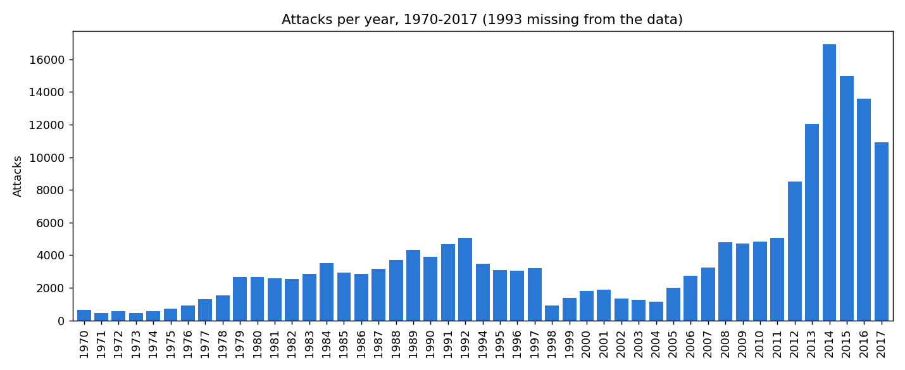
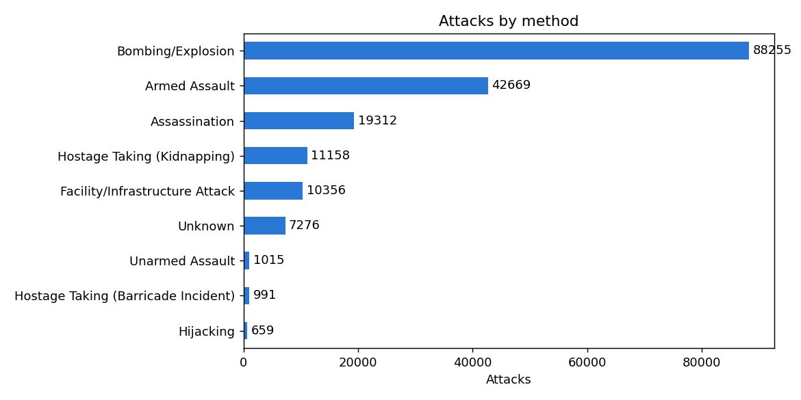
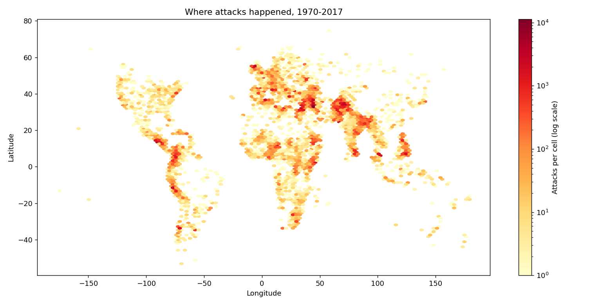

# Global Terrorism Database Analysis

Exploratory analysis of the [Global Terrorism Database (GTD)](https://www.start.umd.edu/gtd/): 181,691 recorded attacks from 1970 to 2017 (1993 is missing because those records were lost).

## Questions
1. Are the number of attacks and casualties related, and which years are outliers?
2. What are the most common attack methods, and how does the mix vary by region and decade?
3. Where did attacks happen?

## Highlights
- Attacks peaked in 2014 (16,903), driven mostly by Iraq, Pakistan and Afghanistan. The earlier rise (1979-1992) came largely from Peru, El Salvador and Colombia.
- Attacks and yearly casualties are strongly correlated (Pearson 0.95, Spearman 0.83); 1998-2007 have unusually high casualties per attack.
- Bombing/Explosion (48.6%), Armed Assault (23.5%) and Assassination (10.6%) make up about 83% of attacks.
- Data quality notes: 45.6% of attacks have an unknown group, a likely duplicated 2001 US event, and one corrupted longitude (fixed).

## Charts

## Files
- `terrorism_analysis_clean.ipynb` - the cleaned, written-up analysis
- `analysis.ipynb` - original working notebook

## Data
The dataset is not included (too large for GitHub). Download `globalterrorismdb_0718dist` from [Kaggle](https://www.kaggle.com/datasets/START-UMD/gtd) or START, and place `globalterrorismdb_0718dist.tar.bz2` in the project folder.

## Requirements
Python 3, pandas, numpy, matplotlib, jupyter.
